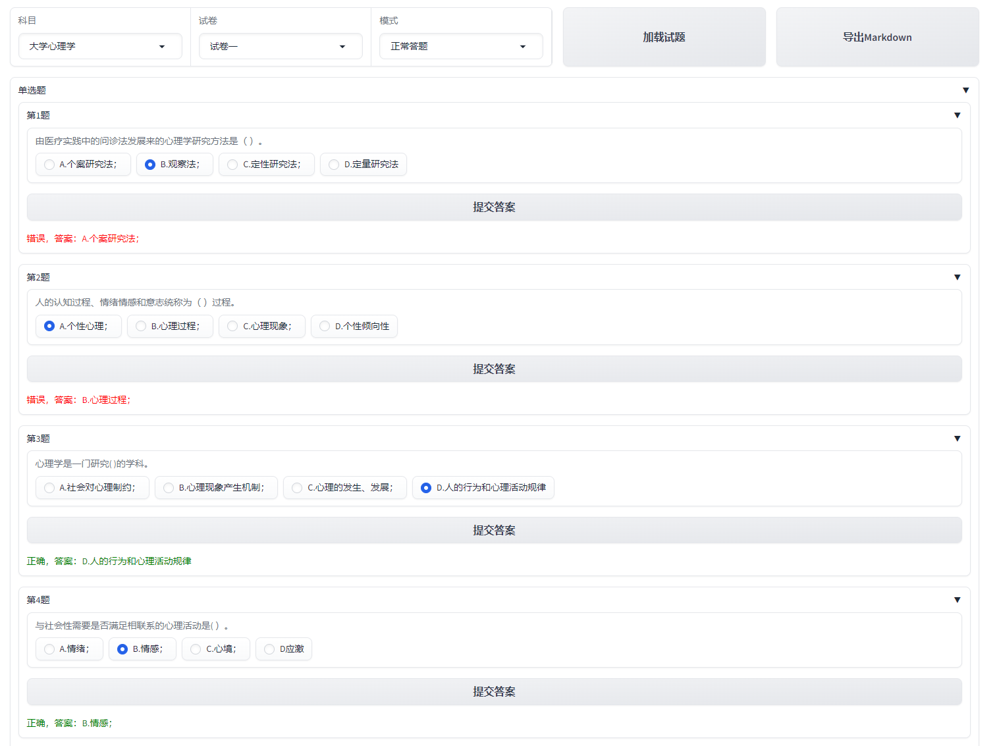

# description
用于爬取浙江省高校教师教育理论培训考试练习题目，并提供在线答题、错题重答、导出Markdown等功能。

## requirement installation
```bash
pip install -r requirements.txt
```
## run the code
```bash
# download and extract data
python extraction.py

# run the gradio interface
python web.py
```

## usage
1. 打开浏览器，访问gradio界面 (http://127.0.0.1:7860/)。
2. 点击科目选择框，选择要练习的科目，包括大学心理学、高等教育法规、高等教育学、以及教师伦理学。

3. 点击试卷选择框，选择要练习的试卷（每个科目20套卷子）。

4. 点击模式选择框，选择练习模式，包括正常答题模式、错题重练模式、错题集模式。

   - 正常答题模式：显示所有问题。
    
   - 错题重练模式：显示错题或未答过的题目。
    
   - 错题集模式：直接显示错题或未答过的题目的答案。
    
5. 导出Markdown：点击导出按钮，将所有试卷的题目和答案导出为Markdown文件。
